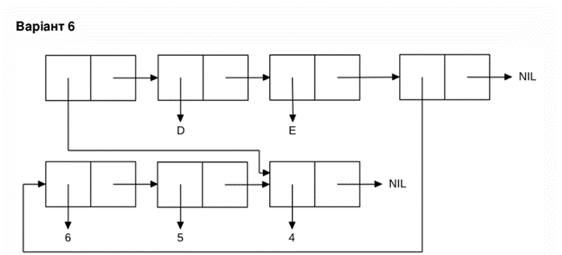

<p align="center"><b>МОНУ НТУУ КПІ ім. Ігоря Сікорського ФПМ СПіСКС</b></p>
<p align="center">
<b>Звіт з лабораторної роботи 1</b><br/>
"Обробка списків з використанням базових функцій"<br/>
дисципліни "Вступ до функціонального програмування"
</p>
<p align="right">Студент: Гусельніков Антон Олексійович КВ-12</p>
<p align="right">Рік: 2024</p>

## Загальне завдання
### Пункт 1
Створіть список з п'яти елементів, використовуючи функції ```LIST``` і ```CONS```. Форма створення списку має бути одна — використання ```SET``` чи ```SETQ``` (або інших
допоміжних форм) для збереження проміжних значень не допускається. Загальна кількість елементів (включно з підсписками та їх елементами) не має перевищувати
10-12 шт. (дуже великий список робити не потрібно). Збережіть створений список у якусь змінну з ```SET``` або ```SETQ``` . Список має містити (напряму або у підсписках):
* хоча б один символ
* хоча б одне число
* хоча б один не пустий підсписок
* хоча б один пустий підсписок
```lisp
CL-USER> (set 'lst (list 'a 21 '(d f g) () NIL))|
(A 21 (D F G) NIL NIL)
```
### Пункт 2
Отримайте голову списку.
```lisp
CL-USER> (car lst)
A
```
### Пункт 3
Отримайте хвіст списку.
```lisp
CL-USER> (cdr lst)
(21 (D F G) NIL NIL)
```
### Пункт 4
Отримайте третій елемент списку.
```lisp
CL-USER> (third lst)
(D F G)
```
### Пункт 5
Отримайте останній елемент списку.
```lisp
CL-USER> (last lst)
(NIL)
```
### Пункт 6
Використайте предикати ```ATOM``` та ```LISTP``` на різних елементах списку (по 2-3
приклади для кожної функції).
```lisp
CL-USER> (atom (car lst))
T
CL-USER> (atom (third lst))
NIL
CL-USER> (atom (last lst))
NIL
CL-USER> (listp (car lst))
NIL
CL-USER> (listp (third lst))
T
CL-USER> (listp (last lst))
T
```
### Пункт 7
Використайте на елементах списку 2-3 інших предикати з розглянутих у розділі 4
навчального посібника.
```lisp
CL-USER> (eq (car lst) 'a)
T
CL-USER> (equalp (second lst) 21.0)
T
CL-USER> (numberp (car lst))
NIL
```
### Пункт 8
Об'єднайте створений список з одним із його непустих підсписків. Для цього
використайте функцію ```APPEND```.
```lisp
CL-USER> (append lst (third lst))
(A 21 (D F G) NIL NIL D F G)
```

## Варіант №6

<p align="center">

</p>

```lisp
CL-USER> (setq lst (list 6 5 4))
(6 5 4)
CL-USER> (list (last lst) 'd 'e lst)
((4) D E (6 5 4))
```
